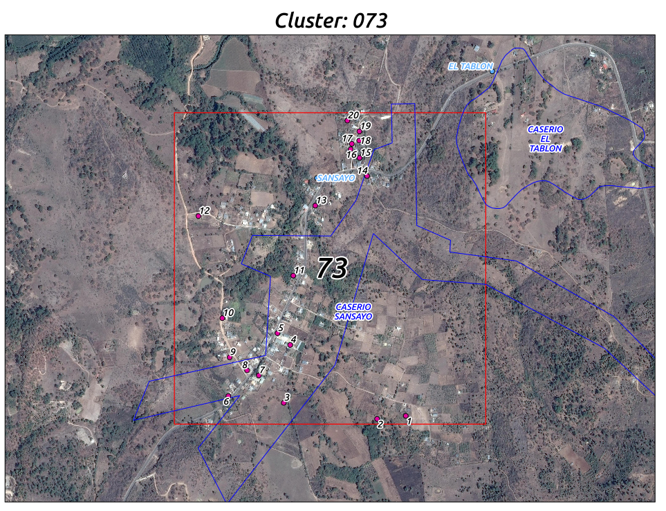

```{r setup, echo=FALSE, message=FALSE, warning=FALSE}
# Load used packages
library(package = "readxl")
library(package = "raster")
library(package = "rgeos")
library(package = "maptools")
library(package = "tidyverse")

# Configure knitr
knitr::opts_chunk$set(echo = FALSE, message = FALSE, warning = FALSE)
knitr::opts_knit$set(root.dir = "..")

# Configure presentation
dpi <- 92
```


## Outline

### **Purpose**

- Rationale for the scoping survey sample design
- Details about the sampling frame for households


### **Two stage sampling design**

- Clusters selected proportional to size
- Households selected randomly within clusters


## Sampling parameters

<div class="notes">
To define and randomly select clusters within the study area
it is necessaty to know the number and location of households.
Since this information is not available, I used the population density provided by WorldPop.
These data are delivered as a spatial raster with a resolution of 8.33x10^-4^ degrees
(approximately 100x100m at the equator)
containing the predicted number of inhabitants per cell.
To inform the cluster selection with these data we have to make an assumption
about the number of inhabitants per household (*i.e.* the household size),
and we also need to account for failure to include households (percent response)
and for selecting unsuitable clusters (*e.g.* clusters without enough households).
I included below the values used for these assumptions.
</div>


```{r sampling-parameters, echo=TRUE}
# Population parameters
household_size <- 6                                # people per household

# Sampling parameters
sample_size <- 400                                 # households
cluster_size <- 10                                 # households per cluster
n_clusters <- ceiling(sample_size / cluster_size)  # enough clusters for ss

# Inefficiency
response <- 2/3                                # proportion contacted included
suitable <- 1/5                                # proportion of suitable clusters
adj_clusters <- ceiling(n_clusters / suitable) # Adjusted number of clusters

```


## Study area


```{r get-limits-data}
# Set included municipalities
included <- c(
  "Jalapa", "San Pedro Pinula", "San Carlos Alzatate", "San Luis Jilotepeque"
)

# Read in limits
municipalities <- readShapePoly(
  fn = "data/shapefiles/borders/municipalities.shp"
)

# Keep only Jalapa
jalapa <- municipalities %>%
  subset(as.character(COD_MUNI) >= 2100 & as.character(COD_MUNI) < 2200)

# Keep only study municipalities
study_munis <- jalapa %>%
  subset(MUNICIPIO %in% included)

# Get top left corner
top_left <-  study_munis %>%
  bbox %>%
  as.data.frame() %>%
  rownames_to_column(var = "direction") %>%
  gather(variable, coordinate, -direction) %>%
  group_by(direction) %>%
  slice(which.max(abs(coordinate))) %>%
  select(direction, coordinate) %>%
  spread(direction, coordinate) %>%
  set_names(toupper(names(.)))

# Read exluded areas
excluded_communities <- "./data/jalapa-excluded-communities.csv" %>%
  # Get the list
  read_csv() %>%
  filter(
    !NUEVO_COD %in% c(2101222, 2101047)
  ) %>%
  # Extend west and north
  bind_rows(
    .,
    top_left,
    mutate(top_left, Y = min(.$Y))
  ) %>%
  # Convert to spatial object
  SpatialPointsDataFrame(
    coords = select(., long = X, lat = Y),
    # coords.nrs = 1:2,
    data = .,
    proj4string = CRS("+init=epsg:4326")
  )

# Get Jalapa "metro" area to exclude it
jalapa_metro <- readShapePoly(
  "./data/shapefiles/community_outlines/Poligonos lugares poblados.shp"
) %>%
  subset(NAME == "JALAPA")

# Set Xalapam area
xalapam <- excluded_communities %>%
  gConvexHull() %>%
  # Intersect with study municipalities
  gIntersection(study_munis)

# Get the convex hull containing the excluded comunities and Jalapa "metro"
excluded_hull <- xalapam %>%
  # Join with Jalapa "metro" area
  gUnion(jalapa_metro)

# Subtract excluded areas
study_area <- gDifference(study_munis, excluded_hull)
```


```{r geo-limits, results='hold', dpi=dpi, fig.width=9, fig.height=5}
# Excluded areas
dpar <- par()
par(mar = c(0, 0, 2, 0))
plot(jalapa, col = "grey90")
plot(study_munis, col = "white", add = TRUE)
plot(excluded_hull, col = "grey40", add = TRUE)
title(
  main = paste0(
    "Fig. 3: Study area\n",
    "Light gray = not included, dark gray = excluded for being unsuitable."
  )
)
text(
  coordinates(study_munis) - matrix(c(0, -0.02, 0, 0, 0, 0.05, 0, 0), ncol = 2),
  labels = gsub(
    pattern = " ",
    replacement = "\n",
    x = iconv(
      x = as.character(study_munis$MUNICIPIO),
      from = "Latin1",
      to = "ASCII//TRANSLIT"
    )
  ),
  cex=0.6
)
par(dpar)
```


# Sampling stage 1 - clusters

## Overview

- Defining clusters based on available information
- Randomly selecting clusters so that every household in the study area
has the same probability of being included in the assessment
- Evaluating sampled clusters for suitability
- Finding nearby health services to evaluate


### **Unavailable information**

- Population estimates
    + Last census in 2002
- Recent cartography
    + Communities shapefiles used for last census
    + Detailed cartography for the communities


## Population density models


```{r get-density-data}

# Read in rasters
pop_density <- raster(x = "data/jalapa_density.gri")

# Limit to study area
study_density <- rasterize(study_area, pop_density, mask = TRUE)

# Median cell density
median_density <- median(study_density[], na.rm = TRUE)

# Minimum cluster (area) population for household_size
min_cluster_pop <- household_size * (cluster_size / response)

# Inflate cluster size to ensure enough households
adj_cluster_pop <- min_cluster_pop * 2 / median_density

# Calculate cells per (square) cluster
cluster_side <- ceiling(sqrt(adj_cluster_pop))

# Aggregate population cells
cluster_cells <- aggregate(study_density, fact = cluster_side, fun = sum)

# Percent with enough estimated households
cluster_ecdf <- ecdf(cluster_cells[])
percent_small <- ceiling(cluster_ecdf(cluster_size / response)*100)
```


```{r pop-density, results='hold', dpi=dpi, fig.width=9, fig.height=3}
# Raw density
dpar <- par()
par(mar = c(2, 2, 3, 1))
plot(study_density)
plot(jalapa, add = TRUE, asp = 1)
plot(excluded_hull, add = TRUE, col = "grey20", asp = 1)
lines(study_munis, col = "red")
par(dpar)
```


### **Constraints**

<div class="notes">

In **Fig. 4** I show the raw population density from the WorldPop model,
masked by the excluded areas (in dark grey).
The highest population densities
(~`r round(max(study_density[], na.rm = TRUE))` persons per household, pph)
are found close to (and inside) the excluded Jalapa "metropolitan" area.
The population density is skewed to lower values
(median ~ `r round(median_density)`, **Fig. 5**),

so we have to carefully define the clusters geographical extent to improve
the probability of selecting clusters with an addequate number of households.
We want to sample `r cluster_size` households within each cluster, and considering
a `r signif(response*100, 3)`% of response we need to have *at least*
`r ceiling(cluster_size / response)` households,
amounting to `r min_cluster_pop` individuals per cluster.
To define the geographical extent for the clusters I took into account that
50% of the ~100x100m WorldPop cells have a value smaller than `r round(median_density)`,
and adjusted the cluster population to ~`r ceiling(adj_cluster_pop)` to ensure
that most clusters have at least the number of households we want to sample.

The resulting cluster population requires to aggregate the population density data
to square "cluster sized" cells with `sqrt(adjusted population)` ~ `r cluster_side`
raw cells per side, assuming the median density per cell.
This aggregation results in cells with a resolution of roughly `r signif(res(cluster_cells)[1], 1)`
degrees, or `r cluster_side*100`m,
with at most `r percent_small`% containing less than `r cluster_size / response` households.
I used the total population of each cluster-sized cell as weights to
randomly select `r adj_clusters` clusters with probability proportional to size, with replacement.
Since the next sampling stage involves randomly picking the same number of 
households within each cluster,
this would ideally allow for every household in the study area to have the
same probability of being selected.

Using the value of each cell relative to the maximum value among all cells
as the probability to sample it.

A very common approach to spatial sampling uses *geographically balanced sampling*,
which ensures equally-sized areas are represented in the sampling
(usually through some sort of tesselation).
This is very important when there is a strong spatial effect on the dependent
variables or covariates,
but less so when no spatial associations are expected.
The method used to select the clusters in this document *does not* provide a
spatially balanced sample,
but this should not have a big impact on representativity since most of the study
area is so sparesly populated.
selected clusters.

</div>

- We want to enroll `r cluster_size` households within each cluster,
so need to sample *at least* `r ceiling(cluster_size / response)`
since some will likely not be houses
- We use `r cluster_side` per side to get clusters with a modeled value of
`r ceiling(adj_cluster_pop)` inhabitants
- Clusters with a resolution of roughly `r signif(res(cluster_cells)[1], 1)`
degrees, or `r cluster_side*100`m per side


```{r sample-clusters}
# Set seed for reproducibility
set.seed(2017-05)

# Half width
hs <- res(cluster_cells)/2

# Calculate weights
weights <- cluster_cells
weights[is.na(weights[])] <- 0         # set NAs to 0 for sampling
weights <- weights / max(weights[])    # scale to probabilities

# First stage of sampling: sample clusters
sampled_clusters <- sample(
  x = seq_len(length.out = length(weights[])),
  size = adj_clusters,
  replace = TRUE,
  prob = weights[]
)

# Get locations of sample clusters
centers <- xyFromCell(cluster_cells, sampled_clusters)

# Get polygons for each cluster
cluster_cells[is.na(cluster_cells)] <- 0
cluster_polygons <- rasterToPolygons(
  x = cluster_cells
)[unique(sampled_clusters), ]


# Collect data for sample clusters
clusters <- cluster_polygons@data %>%
  rownames_to_column(var = "cell_id") %>%
  mutate(
    correlative = seq(1, n()),
    times = as.vector(table(sampled_clusters)),
    households = layer / household_size
  ) %>%
  select(correlative, cell_id, times, population = layer, households) %>%
  bind_cols(as_tibble(unique(centers))) %>%
  rename(lat = y, long = x)

# Force rownames on cluster data
rownames(clusters) <- clusters$cell_id


# Edit clusters data
cluster_polygons <- SpatialPolygonsDataFrame(
  Sr = cluster_polygons,
  data = clusters,
  match.ID = TRUE
)
```


[^3]: A spatially balanced sample could prove more useful for the second sampling
stage, given that factors at a lower geographical scale
(e.g. point sources of pollution such as factories, sites with regular crop burning,
or areas with heavier motor vehicle trafic) could have a big effect on individual
households.


## Sampled clusters

```{r clusters-density, dpi=dpi, fig.width=9, fig.height=5}
dpar <- par()
par(mar = c(2, 2, 3, 1))
plot(cluster_cells)
plot(jalapa, add = TRUE, asp = 1)
lines(excluded_hull, col = rgb(0, 0, 1, 0.5), add = TRUE, asp = 1)
plot(cluster_polygons, add = TRUE, asp = 1)
text(
  coordinates(cluster_polygons),
  labels = cluster_polygons$correlative,
  cex = 0.4, col = "red"
)
par(dpar)
```


```{r write-data, cache=TRUE}
# Write cluster data
clusters %>%
    mutate(
        tipo = "",
        suficientes = "",
        comentario = ""
    ) %>%
  write_csv(path = "output/clusters.csv")

# Write cluster polygons
writeSpatialShape(cluster_polygons, fn = "output/clusters/clusters")

# Function to get cluster tiles
get_tile <- function(cluster, save_path, zoom = 16){
  # file path
  save_path <- file.path(
    save_path,
    stringr::str_pad(
      string = cluster$correlative, width = 2, side = "left", pad = "0"
    )
  )
  
  if(!file.exists(paste0(save_path, ".tif"))){
    # cell center
    center <- cluster[c("lat", "long")] %>% unlist()
    
    # Get tile
    cell <- RgoogleMaps::GetMap(
      center = center[c("lat", "long")], zoom=16, maptype = "satellite"
    )
    
    # Convert to raster
    bb <- cell$BBOX
    cell <- stack(file.path(tempdir(), "mapTile.png"))
    extent(cell) <- extent(bb$ll[,2],bb$ur[,2],bb$ll[,1],bb$ur[,1])
    
    # Save as GTiff
    writeRaster(
      x = cell, filename = save_path, format = "GTiff", overwrite = TRUE
    )
    # Copy the downloaded png
    file.copy(file.path(tempdir(), "mapTile.png"), paste0(save_path, ".png"))
    
  }
  
  cell <- brick(paste0(save_path, ".tif"))
  
  return(cell)
}

# Get all cells
clusters <- clusters %>%
  group_by(correlative, times, population, households, lat, long) %>%
  do(
    cell = get_tile(cluster = ., save_path = "output/cluster_satellite")
  ) %>%
  ungroup()
```


## Cluster evaluation

```{r cluster-suitability, include=FALSE}
# Load visual assessment data
jrivera <- read_csv("data/roofs/cluster_rapid_jrivera.csv")
aramirez <- read_excel("data/roofs/cluster_rapid_aramirez.xlsx")


# Standardize input
st_jrivera <- jrivera %>%
  select(
    correlative, cell_id,
    jr_type = tipo, jr_assesment = suficientes, jr_comment = comentario
  ) %>%
  mutate(
    jr_type = case_when(
      grepl("Rural", jr_type, ignore.case = TRUE) ~ "rural",
      grepl("Urb", jr_type, ignore.case = TRUE) ~ "urban",
      is.na(jr_type) ~ NA_character_,
      TRUE ~ "error"
    )
  )

st_aramirez <- aramirez %>%
  select(
    correlative, cell_id,
    ar_type = tipo, ar_assesment = suficientes, ar_comment = comentario
  ) %>%
  mutate(
    ar_type = case_when(
      grepl("R", ar_type, ignore.case = TRUE) ~ "rural",
      grepl("U", ar_type, ignore.case = TRUE) ~ "urban",
      is.na(ar_type) ~ NA_character_,
      TRUE ~ "error"
    )
  )


#------------------------------------------------------------------------------*
# Review assessment
#------------------------------------------------------------------------------*

# Join assessments
assessment <- st_aramirez %>%
  left_join(st_jrivera)


# Compare assesment

# Evaluated by jrivera
assessment %>% filter(jr_type %in% c("urban", "rural")) %>% nrow()

# Evaluated by aramirez
assessment %>% filter(ar_type %in% c("urban", "rural")) %>% nrow()

# Concordance among evaluated
assessment %>% filter(!is.na(jr_type)) %>% count(ar_type, jr_type)

# Review discordances in cluster type (rural vs urban)
assessment %>%
  filter(
    !is.na(jr_type),
    jr_type != ar_type
  )

# Review discordances in cluster suitability
assessment %>%
  filter(
    !is.na(jr_type),
    jr_assesment != ar_assesment,
    # Remove cluster 60 (cell id 1127)
    correlative != 60
  ) %>%
  select(-ar_comment, -jr_comment)


# Get list of clusters evaluated as suitable
suitable <- assessment %>%
  filter(
    ar_assesment == 1,
    correlative != 57
  )

```


- Selected `r adj_clusters` with probability proportional to size
- All randomly selected clusters were evaluated by two independent reviewers
    + Looking at recent satellite imagery for each cluster
    + Estimating the number of visible roofs
    + Clusters were deemed suitable if at least 20 roofs were observed by the reviewer

### **Suitable clusters**

```{r suitable-clusters}
suitable_clusters <- clusters %>%
  filter(
    correlative %in% suitable$correlative
  ) %>%
  select(-cell)

selected_clusters <- cluster_polygons %>%
  subset(
    cluster_polygons$correlative %in% suitable_clusters$correlative
  )

suitable_clusters %>%
  mutate_if(
    is.numeric,
    funs(round(., 2))
  ) %>%
  arrange(
    desc(times), correlative
  ) %>%
  select(
    Cluster = correlative,
    "Times sampled" = times,
    "Modeled population" = population,
    "Modeled households" = households,
    Latitude = lat, Longitude = long
  ) %>%
  knitr::kable()
```


## Nearby health services

```{r nearby-services}
# Read services recorded for Jalapa
services <- sf::read_sf(
  dsn = "data/shapefiles/services/health-services.shp",
  crs = "+init=epsg:4326"
)

# Get data for relevant health related services
health_services <- services %>%
  # Remove services in excluded areas
  sf::st_difference(
    sf::st_as_sf(excluded_hull, crs = "+init=epsg:4326")
  ) %>%
  mutate(
    servicio = tolower(servicio),
    tipo_serv = tolower(tipo_serv),
    service_type = recode_factor(
      tolower(tipo_serv),
      "puesto de salud" = "post",
      "centro convergencia" = "convergence",
      "centro de salud" = "center",
      .default = "other",
      .ordered = TRUE
    )
  ) %>%
  select(
    codgeo, geometry, servicio, tipo_serv, service_type
  ) %>%
  filter(
    service_type != "other"
  ) %>%
  # Add coordinates as regular variables
  bind_cols(
    sf::st_coordinates(.$geometry) %>%
      as_tibble() %>%
      set_names(c("serv_long", "serv_lat"))
  )


# Join services to clusters
nearby_services <- suitable_clusters %>%
  select(correlative, lat, long) %>%
  mutate(join = TRUE) %>%
  left_join(mutate(health_services, join = TRUE)) %>%
  mutate(
    # Distance in meters between cluster centroids and each health service facility
    distance = pointDistance(
      p1 = matrix(c(long, lat), ncol = 2),
      p2 = matrix(c(serv_long, serv_lat), ncol = 2),
      lonlat = TRUE
    )
  ) %>%
  # Keep the 5 facilites closest to each cluster
  arrange(correlative, distance) %>%
  group_by(correlative) %>%
  slice(1) %>%
  ungroup()

# Function to create lines shape from data frame
df_to_line <- function(df){
  lines <- df %>%
    select(long, lat) %>%
    as.matrix() %>%
    Line %>%
    Lines(ID = first(df$cluster))
}

# Lines connecting services to clusters
connect_services <- nearby_services %>%
  select(
    cluster = correlative, servicio, clust_lat = lat, clust_long = long,
    serv_lat, serv_long
  ) %>%
  gather(key = type, value = value, -cluster, -servicio) %>%
  separate(type, into = c("type", "coord"), sep = "_") %>%
  spread(key = coord, value = value) %>%
  split(.$cluster) %>%
  map(df_to_line) %>%
  SpatialLines(proj4string = CRS("+init=epsg:4326"))

# Save data for closest service by cluster
nearby_services %>%
  mutate(
    distance = paste(round(distance/1000, 2), " km")
  ) %>%
  arrange(servicio) %>%
  select(
    cluster = correlative,
    distance,
    service_name = servicio,
    service_code = codgeo,
    service_type,
    service_lat = serv_lat,
    service_long = serv_long
  ) %>%
  write_csv(
    path = "output/nearby-health-services.csv"
  )
```


```{r clusters-services, dpi=dpi, fig.width=9, fig.height=5}
dpar <- par()
par(mar = c(2, 2, 3, 1))
# Base map
plot(jalapa, asp = 1)
lines(excluded_hull, col = rgb(0, 0, 1, 0.5), add = TRUE, asp = 1)
# Clusters and lines to services
lines(connect_services, col = "blue")
plot(selected_clusters, add = TRUE, asp = 1, col = "white")
# Label clusters
text(
  coordinates(selected_clusters),
  labels = selected_clusters$correlative,
  cex = 0.4, col = "red"
)
# Unique services
unique_services <- nearby_services %>%
  select(servicio, serv_long, serv_lat) %>%
  unique()
# Label services
raster::text(
  as.matrix(select(unique_services, serv_long, serv_lat)),
  labels = unique_services$servicio,
  cex = 0.4, col = "blue",
  halo = TRUE
)

par(dpar)
```


# Sampling stage 2 - households

## Overview

- Describe manual rooftop extraction
- Describe rooftop sampling
- Describe methodology for finding households in the field


## Rooftop extraction and sampling

Satellite images used to extract rooftops

<a href="cluster-maps/cluster_073.pdf" target="_blank">
</img>
</a>


## Finding households

### **Before leaving for the field**

- Define cluster to visit
- Load sampled rooftops coordinates to GPS receivers


### **Once in the cluster**

- Navigate to one of the rooftops coordinates
- Find two closest structures
- Get random selection from RedCap questionnaire
(randomized during rooftop sampling and preloaded to server)


